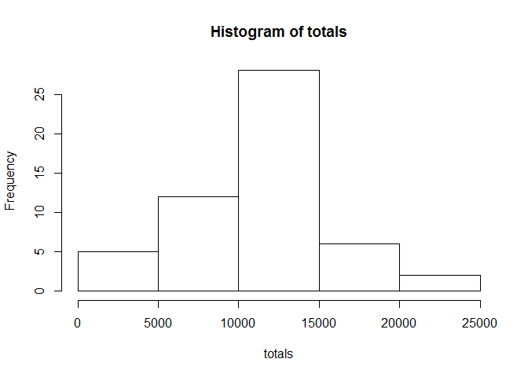
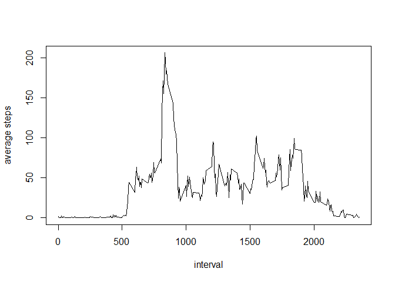
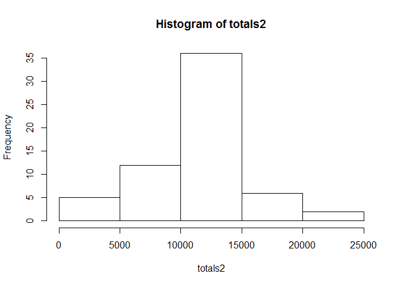
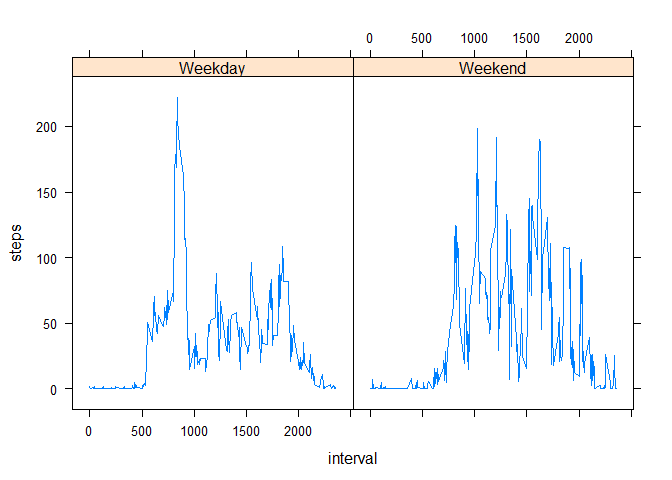

# Reproducible Research: Peer Assessment 1


## Loading and preprocessing the data

```r
dat<-read.csv("activity.csv")
lev<-levels(dat$date)
```


## What is mean total number of steps taken per day?

```r
totals<-tapply(dat$steps,dat$date,sum) #totals by date
hist(totals)
```

<!-- -->

```r
mean(totals,na.rm=T) #mean total steps in a day
```

```
## [1] 10766.19
```

```r
median(totals,na.rm=T) #median total steps in a day
```

```
## [1] 10765
```


## What is the average daily activity pattern?

```r
t<-tapply(dat$steps,dat$interval,mean,na.rm=T) #mean steps by interval
plot(as.numeric(names(t)),t,xlab="interval",ylab="average steps",type="l")
```

<!-- -->

```r
names(t[t=max(t)]) #find interval with max steps
```

```
## [1] "1705"
```


## Imputing missing values

```r
sum(!complete.cases(dat)) #number of missing values
```

```
## [1] 2304
```

```r
dat2<-dat #copy dat, change NA to average over interval
dat2[is.na(dat2$steps),1]<-t[as.character(dat2[is.na(dat2$steps),]$interval)] 
totals2<-tapply(dat2$steps,dat2$date,sum) #total up by date
hist(totals2) 
```

<!-- -->

```r
mean(totals2,na.rm=T) #mean w/o NA
```

```
## [1] 10766.19
```

```r
median(totals2,na.rm=T) #median w/o NA
```

```
## [1] 10766.19
```


## Are there differences in activity patterns between weekdays and weekends?

```r
library(lattice)
dat[,4]<-weekdays(as.Date(dat[,2])) #find out weekend or weekday
dat[dat[,4]=="Sunday"|dat[,4]=="Sunday",4]<-"Weekend"
dat[dat[,4]!="Weekend",4]<-"Weekday"

#find mean by weekend/weekday
tend<-tapply(dat[dat[,4]=="Weekend",1],dat[dat[,4]=="Weekend",3],mean,na.rm=T)
tday<-tapply(dat[dat[,4]=="Weekday",1],dat[dat[,4]=="Weekday",3],mean,na.rm=T)
#make a dataframe
tend.lbl<-rep("Weekend",length(tend))
tday.lbl<-rep("Weekday",length(tday))
dat.weekday<-data.frame(c(tend,tday),c(tend.lbl,tday.lbl),c(as.numeric(names(tend)),as.numeric(names(tday))))
names(dat.weekday)<-c("steps","weekday","interval")
#plot
xyplot(steps~interval|weekday,data=dat.weekday,type='l')
```

<!-- -->
